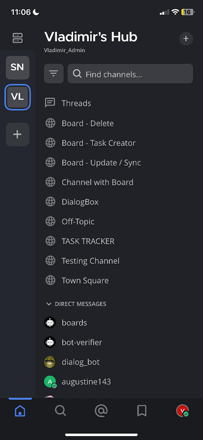

# Ticket #MM-001 – Mattermost Board to Google Calendar Sync Limitation (Mobile Access Issue)

- **Status**: Resolved (via Automation Workaround)  
- **Priority**: High  
- **Category**: Integration / Automation  

---

## Issue Description
Users are unable to create, update, delete, or sync calendar events from the Mattermost Board when using the mobile application. The mobile version of Mattermost does not support Board functionality, resulting in a workflow limitation for event management on-the-go.

---

## Environment
- **Platform**: Mattermost (Desktop + Mobile)  
- **Automation Tool**: n8n  
- **Integration**: Google Calendar API  
- **UI Layer**: Custom HTML Web Interface  
- **Data Source**: Mattermost Board  

---

## Symptoms
- Mattermost mobile app does not display Board feature  
- Users cannot create or manage events via mobile  
- No direct Google Calendar integration from Board  
- Manual event syncing required prior to fix  

**Figure: Mattermost Mobile Application (Board Feature Not Available)**

---

## Troubleshooting Process
1. Verified Mattermost mobile app feature limitations (Board not supported)  
2. Tested event creation workflow on mobile vs desktop  
3. Confirmed absence of native Google Calendar integration  
4. Evaluated possible API-based integration approaches  
5. Implemented automation prototype using n8n  
6. Built HTML-based web UI for CRUD operations  
7. Connected Mattermost Board → n8n workflow → Google Calendar API  

**Figure: Mattermost Web Interface with Board Functionality**

---

## Root Cause
Mattermost mobile application does not support Board functionality, and there is no native integration between Mattermost Boards and Google Calendar.

---

## Resolution
Implemented an n8n-based automation workflow with a custom HTML web interface to enable task management and synchronization with Google Calendar.

This solution bypasses mobile limitations by providing a secure, browser-accessible interface.

---

## Architecture Overview
The system follows this workflow:

Mattermost Slash Command → Bot → Secure URL → HTML UI → n8n Workflow → Google Calendar API

This design ensures secure, time-limited access and seamless synchronization between platforms.

---

## Implementation Details
For full system walkthrough and screenshots:

[View Implementation Details](./MM-001-Implementation.md)

---

## Verification
- Events successfully created and reflected in Google Calendar  
- Updates and deletions correctly synced  
- Workflow accessible via mobile browser  
- Mattermost Board data properly mapped to calendar events  

---

## Lessons Learned
Mobile feature limitations in collaboration tools can disrupt workflows, but API-driven automation (e.g., n8n + Google Calendar API) can effectively bridge missing native functionality. Web-based UI layers provide a practical workaround when mobile clients lack feature parity.
